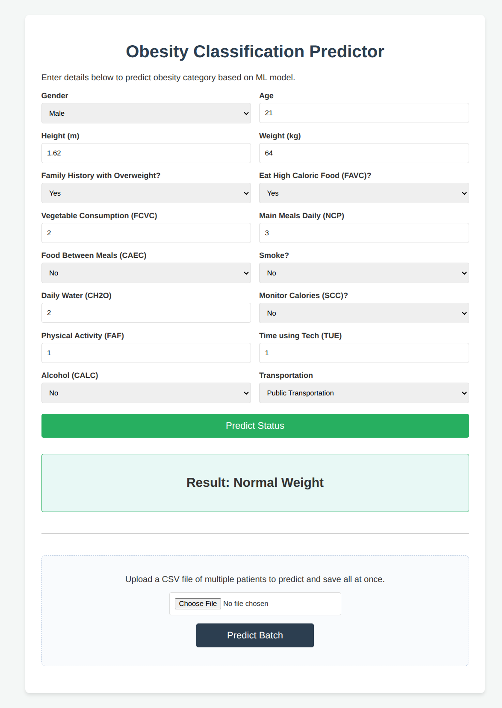
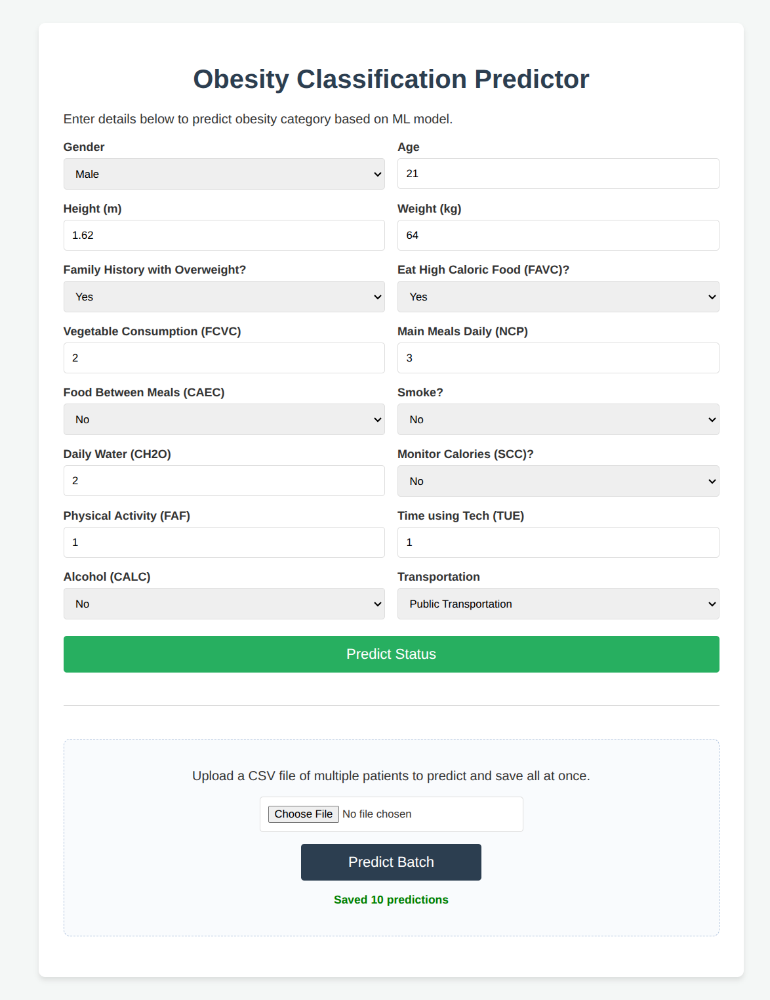
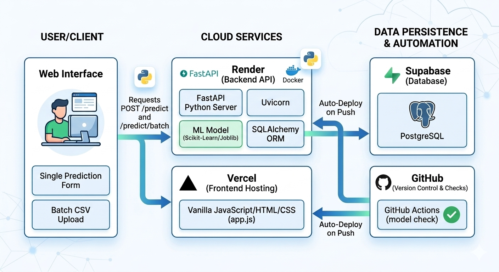

<div align="center">

# 🏥 Obesity Classification App

**Predict a person's obesity level from 16 simple inputs. Use one form or upload a whole CSV.**

[](https://obesity-classification-app.vercel.app)
[](https://obesity-classification-app-z9sy.onrender.com/docs)


</div>

---

## ✨ What it does

| | Feature | Description |
|---|---|---|
| 🧍 | **Single prediction** | Fill in the form and see the result on the page. |
| 📄 | **Batch prediction** | Upload a CSV file and predict every row at once. |
| ☁️ | **Saved in Supabase** | Every prediction (all 16 inputs, the result and the time) is saved in the database. |

## 🖼️ Screenshots

### Single prediction


### Batch prediction


## ⚙️ How it works



```
Frontend (Vercel)
      |
      v
FastAPI (Render)
  |-- /predict        -> ML model -> Supabase
  |-- /predict/batch  -> ML model -> Supabase
```

1. You send data from the web page.
2. The FastAPI server checks the data and runs the ML model.
3. The result is sent back to the page and saved in Supabase.

## 🔢 The 16 inputs

| Input | Meaning | Values |
|---|---|---|
| `Gender` | Gender | Male / Female |
| `Age` | Age in years | Whole number |
| `Height` | Height in meters | e.g. 1.75 |
| `Weight` | Weight in kg | e.g. 80 |
| `family_history_with_overweight` | Family member with overweight? | yes / no |
| `FAVC` | Eats high-calorie food often? | yes / no |
| `FCVC` | Vegetables in meals | 1 to 3 |
| `NCP` | Main meals per day | 1 to 4 |
| `CAEC` | Food between meals | no / Sometimes / Frequently / Always |
| `SMOKE` | Smokes? | yes / no |
| `CH2O` | Daily water intake | 1 to 3 |
| `SCC` | Counts calories? | yes / no |
| `FAF` | Physical activity | 0 to 3 |
| `TUE` | Time using technology | 0 to 2 |
| `CALC` | Alcohol | no / Sometimes / Frequently / Always |
| `MTRANS` | Transport | Automobile / Bike / Motorbike / Public_Transportation / Walking |

**The model gives one of 7 results:** Insufficient Weight, Normal Weight, Overweight Level I, Overweight Level II, Obesity Type I, Obesity Type II, Obesity Type III.

## 📄 Batch CSV format

The CSV needs the 16 columns above (extra columns like `NObeyesdad` are ignored).
You can try the file `sample_batch.csv` from this repo.

- Rows with empty or wrong values are skipped.
- The page shows a message like `Saved 500 predictions`.

## 📁 Project structure

```
obesity-classification-app/
|-- .github/workflows/
|   `-- check.yml                    # GitHub Actions: checks the model on every push
|-- backend/
|   |-- main.py                      # FastAPI app: /predict and /predict/batch
|   |-- ml_utils.py                  # Preprocessing + model prediction
|   |-- obesity_full_pipeline.joblib # Trained model
|   |-- requirements.txt             # Python packages
|   |-- Dockerfile                   # Used by Render
|   |-- .dockerignore
|   |-- .env.example                 # Copy this to .env
|   `-- .env                         # Your real database URL (not uploaded to GitHub)
|-- frontend/
|   |-- index.html
|   |-- app.js
|   |-- style.css
|   `-- config.js                    # Backend URL
|-- images/                          # Pictures used in this README
|-- sample_batch.csv                 # Example file for batch testing
|-- .gitignore
`-- README.md
```

## 💻 Run on your computer

You need **Python 3.11 or 3.12**. Check with `python --version`.

### 1. Create and turn on a virtual environment

```bash
cd backend
```

Windows:
```bash
python -m venv venv
venv\Scripts\activate
```

Mac or Linux:
```bash
python3 -m venv venv
source venv/bin/activate
```

You will see `(venv)` at the start of your terminal line when it is on.

### 2. Install the packages
```bash
pip install -r requirements.txt
```

### 3. Add your database URL
Open `backend/.env` and put your real Supabase `DATABASE_URL`. It must start with `postgresql+psycopg2://`.
(`backend/.env.example` shows the format.)

### 4. Start the backend
```bash
uvicorn main:app --reload
```
Check it at http://localhost:8000/docs

The first time it starts, it creates the `predictions` table in Supabase by itself.

### 5. Start the frontend
1. Open `frontend/config.js` and use the local URL:
   ```js
   API_URL: "http://localhost:8000"
   ```
2. Open `frontend/index.html` in your browser.

### 6. Stop and turn off
Press `Ctrl + C` to stop the server, then run `deactivate`.

## 🤖 Automatic check (GitHub Actions)

The file `.github/workflows/check.yml` runs by itself every time you push to GitHub. It:
1. Installs the packages from `backend/requirements.txt` (Python 3.11).
2. Loads the model and makes one test prediction.

If something is broken, the check fails and you see a red mark on your commit. It does not use your database or any password.

## 🚀 Deploy

### 1. Supabase (database)
- Create a project, then go to **Project Settings -> Database** and copy the connection string.
- Replace `[YOUR-PASSWORD]` with your database password.
- Make the string start with `postgresql+psycopg2://`.

### 2. Render (backend)
1. Push this project to GitHub.
2. On Render: **New -> Web Service** -> choose your repo.
3. Set **Root Directory** to `backend`.
4. Set **Runtime** to **Docker** (Render uses `backend/Dockerfile`).
5. Add an environment variable: `DATABASE_URL` = your Supabase connection string.
6. Deploy. Copy your URL, for example `https://your-app.onrender.com`.

### 3. Vercel (frontend)
1. Open `frontend/config.js` and set your Render URL:
   ```js
   const CONFIG = {
       API_URL: "https://your-app.onrender.com"
   };
   ```
2. Push to GitHub.
3. On Vercel: **Add New -> Project** -> choose your repo.
4. Set **Root Directory** to `frontend`. Framework preset: **Other**. No build command.
5. Deploy.

## 📝 Notes
- Render's free plan sleeps when unused, so the first request can take about a minute.
- If the Supabase connection fails on Render, try the **Session pooler** connection string from Supabase.
- Never upload your `.env` file or your `venv/` folder to GitHub. The `.gitignore` already blocks both.
- Before you deploy, change `frontend/config.js` back to your Render URL.

---

<div align="center">

Built by **Malinda Botheju**

</div>